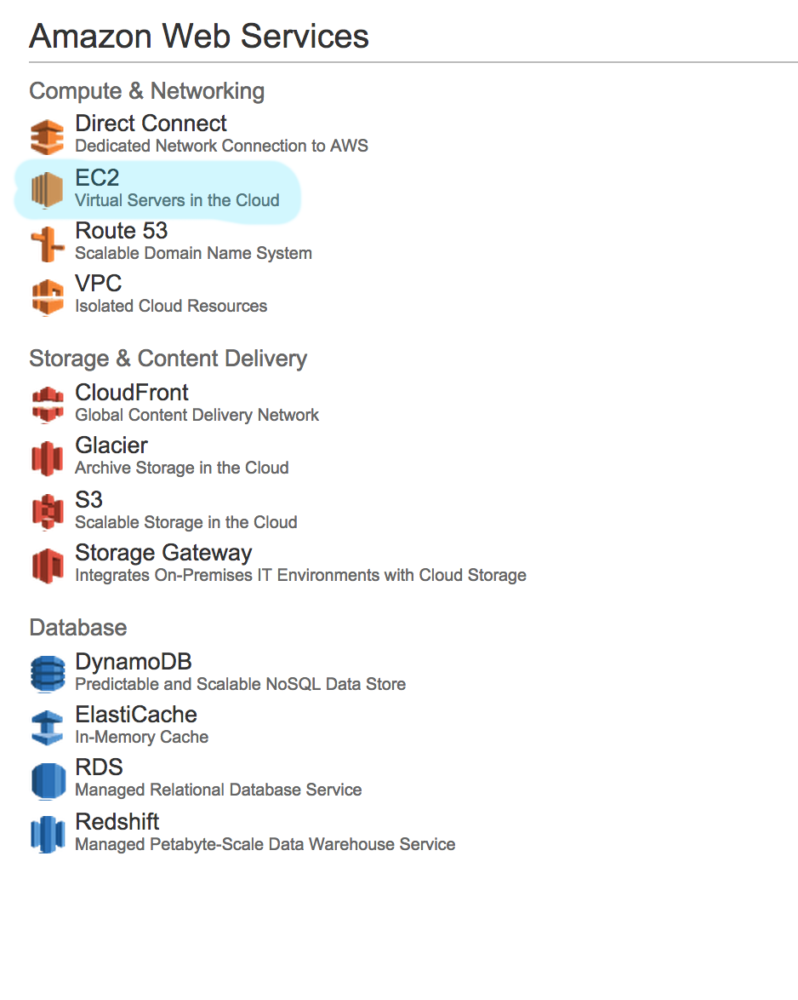

# Hadoop Provisioning for DS on AWS

If you are a data scientist you will know a bit of bash, but provisioning servers for data science might still be a bit daunting. 

In this document I will describe a step by step guidebook I wrote for myself so I could not mess up a CDH Hadoop install on AWS. Where appropriate I will give a verbose description of what I am doing to help people who are more unfamiliar with provisioning (typical data scientists) with understanding what is going on. 

I will use the Cloudera Free Edition for this install, there are other distributions but I feel this distribution suits my needs the best. 

> By the way, you will need to spend some money if you want to following all these steps. It's not a whole lot, but you can't bring a cluster online for free. 

### 1. Log into AWS

Sign up for an account if you haven't done so already. 



Log in and go to the EC2 interface.  

> EC2 stands for elastic cloud. The idea behind EC2 is that you can rent servers on the fly. This means that you can easiliy add servers when you need them and put them down again if you don't need them anymore. 

### 2. Add a security group 

Create a security group with the following settings: 

1. create security group 
2. go back and change rule to apply to security group 

> A security group describes how servers can cumminicate with the outside world. There are different communicating protocols like SSH, TCP and ICMP that we need to use to allow communication between servers. We need to set these settings at an amazon level because the installer that we will use requires them. 

### 3. Create instances 

Don't forget to download the ```.pem``` file. This file gives us access to the machines. 

> The cloudera distribution that we will use assumes a certain version of ubuntu to be running as an operating system.

  
### 4. ssh into machine 

```
chmod 400 ./hadoop.pem
ssh -i hadoop.pem ubuntu@54.76.44.255
```

### 5. download cloudera software 

```
wget http://archive.cloudera.com/cm5/installer/latest/cloudera-manager-installer.bin
sudo su
chmod +x cloudera-manager-installer.bin
./cloudera-manager-installer.bin
```

