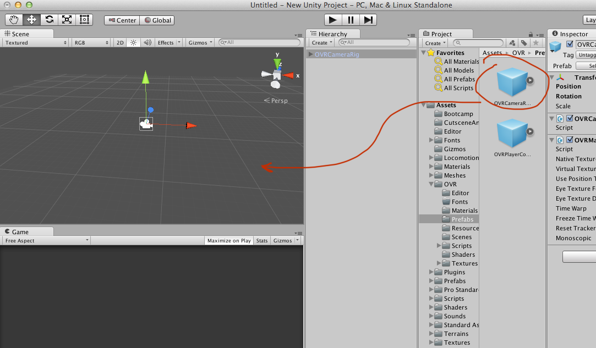
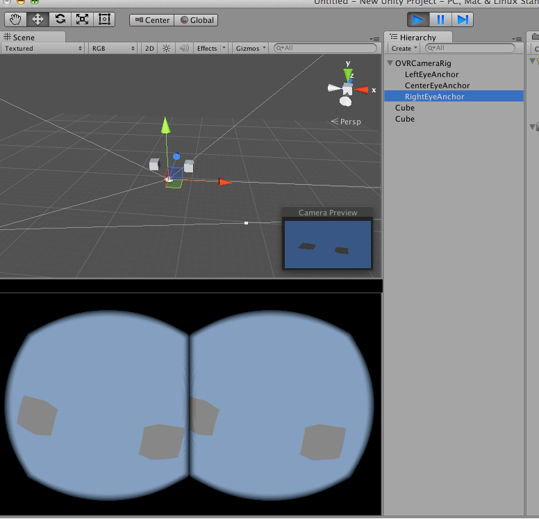
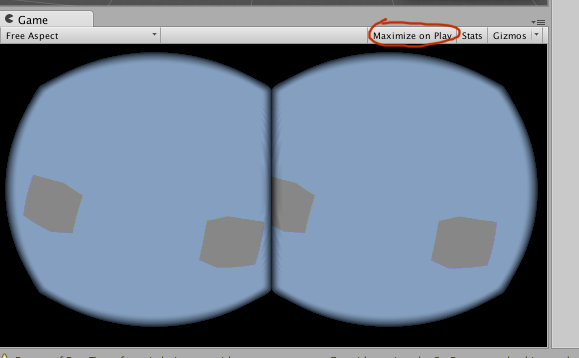
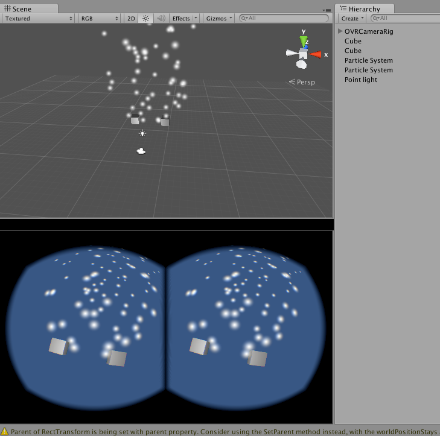

# Minimum Viable Unity with Oculus

I've written a small demo on how to get started with Unity and Oculus. Hopefully it might help others get started. 

## Installation

Go to [this link](https://developer.oculus.com/downloads/) to download the OSX runtime, SDK and Unity integration. 

Unzip and install everything. Make sure you have unity installed and open the ```OculusUnityIntegration.unitypackage``` file in ```OculusUnityIntegration``` folder that you downloaded. When you open this in unity you will have a lot of files added to your unity assets. 

## Minimum Viable Oculus Wow

Drag the ```OVRCameraRig``` into the scene (you can find it in Assets >> OVR >> Prefabs). 



Then add some cubes. If you have your oculus plugged in, you should see the camera react to oculus movement when you've pressed play. 



Unfortunately, when you put on the oculus you may not be see what you've built. If the oculus and your mac share a screen make sure that "Maximize on play" is selected.



You can add more and more things to make the scene pretty. Here, I've added some light and some particle effects. 



## Next Steps

[This](https://www.youtube.com/watch?v=7kuQYcIYPvQ) youtube video might also be very helpful if you are just starting out and want to do a bit more. I would be interested in doing something with physics and music and I have yet to find out where unity might have some performance issues. I have yet to check out the unreal engine but from the blogosphere I get the impression that it is worth checking out. 